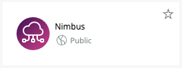
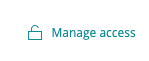

# Nimbus

 

## About this Nerdpack

Nimbus provides a framework to support your Cloud migration process though Plan >> Manage >> Run phases. Using [New Relic Workloads](https://docs.newrelic.com/docs/new-relic-one/use-new-relic-one/workloads/workloads-isolate-resolve-incidents-faster) it allows you to compose groups of Migration Entities and compare the initial and point in time state of the migration. 

## Open source license

This project is distributed under the [Apache 2 license](LICENSE).

## Dependencies

Nimbus works off your existing New Relic account data, using New Relic Workloads to model and track the entities in your pre and post migration contexts. To get the most out of Nimbus you will want to capture as much comparative telemetry from your pre and post migration workloads as possible. This means Infrastructure, APM, Browser, Synthetics, and [Cloud Integration](https://docs.newrelic.com/docs/integrations/infrastructure-integrations/cloud-integrations) Entities. 

If you don't have New Relic Agents installed and want to get going quickly, you can use [New Relic's VMware vSphere Integration](https://docs.newrelic.com/docs/integrations/host-integrations/host-integrations-list/vmware-vsphere-monitoring-integration), this allows you to use vSphere to collect performance KPIs on your VM assets and represent them in pre-migration workloads.   

## Getting started

1. Add Nimbus to your New Relic accounts with the [New Relic Catalog](http://newrelic.com). You can do this by finding the Nimbus App in the New Relic One catalog. Just click on the app

and select the accounts you want to grant access to via the Manage Access feature.

2. Ensure you have all the data you need to compare workloads. The more telemetry you are acquiring from your legacy system the better the position you will be in to compare and contrast how your services operate in the cloud. 

> 2.1 Install New Relic Infrastructure and Application Runtime Agents in your legacy environment
> 
> New Relic Agents provide telemetry allowing you to understand your non-cloud workload performance and capacity KPIs allowing you to make informed decisions for the resource allocation and performance expectations of your migrated services.   

> 2.2 Install the [New Relic vSphere Infrastructure Integration](https://docs.newrelic.com/docs/integrations/host-integrations/host-integrations-list/vmware-vsphere-monitoring-integration)  
> 
> If your legacy services are running in Virtual Machines managed by vSphere, you can gather operational KPIs directly from vSphere and use those metrics to understand the performance and capacity constraints of your legacy systems. If you choose this method, take a look at the "Create Workloads from vSphere Networks" section below to get started.  

> 2.3 Ensure [New Relic Cloud Integrations](https://docs.newrelic.com/docs/integrations/infrastructure-integrations/cloud-integrations) are enabled

> This will allow your migration target workloads to keep track of your Cloud services usage, and how those dependencies affect your migrated services.  

## Using Nimbus

Nimbus provides a context rich UI to help guide you from telemetry acquisition through Migration validation. For a walkthrough of features please see [Nimbus walkthrough](catalog/documentation.md) document. 

# Support

New Relic has open-sourced this project. This project is provided AS-IS WITHOUT WARRANTY OR DEDICATED SUPPORT. Issues and contributions should be reported to the project here on GitHub.

We encourage you to bring your experiences and questions to the [Explorers Hub](https://discuss.newrelic.com) where our community members collaborate on solutions and new ideas.

## Community

New Relic hosts and moderates an online forum where customers can interact with New Relic employees as well as other customers to get help and share best practices. Like all official New Relic open source projects, there's a related Community topic in the New Relic Explorers Hub. You can find this project's topic/threads here:

https://discuss.newrelic.com/t/new-relic-one-nimbus/116523

## Issues / enhancement requests

Issues and enhancement requests can be submitted in the [Issues tab of this repository](../../issues). Please search for and review the existing open issues before submitting a new issue.

## Security

As noted in our [security policy](https://github.com/newrelic/nr1-nimbus/security/policy), New Relic is committed to the privacy and security of our customers and their data. We believe that providing coordinated disclosure by security researchers and engaging with the security community are important means to achieve our security goals.

If you believe you have found a security vulnerability in this project or any of New Relic's products or websites, we welcome and greatly appreciate you reporting it to New Relic through [HackerOne](https://hackerone.com/newrelic).

# Contributing

Contributions are encouraged! If you submit an enhancement request, we'll invite you to contribute the change yourself. Please review our [Contributors Guide](CONTRIBUTING.md).

Keep in mind that when you submit your pull request, you'll need to sign the CLA via the click-through using CLA-Assistant. If you'd like to execute our corporate CLA, or if you have any questions, please drop us an email at opensource+nr1-nimbus@newrelic.com.

