## Using Nimbus 

As indicated in the [Readme](https://github.com/newrelic/nr1-nimbus/blob/master/README.md) Nimbus is a New Relic One Application that helps you to understand the KPIs for [Entities](https://docs.newrelic.com/docs/new-relic-one/use-new-relic-one/core-concepts/what-entity-new-relic) you are migrating from one Datacenter, to another, or to a Cloud Provider. 
  
Using New Relic you can quickly discover the specific Entities or dependencies you want to include as a [Workload](https://docs.newrelic.com/docs/new-relic-one/use-new-relic-one/workloads/workloads-isolate-resolve-incidents-faster). The Workload them becomes the context of before/after migration scenarios. Below is a quick walkthrough of the features of Nimbus. 
 

## Configuration
- The configuration section of Nimbus is all about defining your Workloads and setting on the path to migrating those Workloads. 

### 1. Nimbus Landing Page >> This is where you get started with Nimbus. 
- If you have already defined Workload Migrations you can select them from the drop down list in the top navigation, this will allow you to dig into the migration state of the Workload.
- You can select the period for which you want to roll up the costs associated with your migration (hourly, daily, monthly, yearly). 
- If you're not seeing what you expect, you can click on "Refresh" top re-query your New Relic account contexts and load the available Workloads and Migrations that have been previously defined.  

### 2. Set-up >> Begin by getting telemetry to model your migrations
- "Select your target New Relic account to continue setup" - from the dropdown box you should see the list of accounts the Nimbus Nerdpack has access to. If you're not seeing what you expect, be sure to visit Nimbus' Application Catalog page and select the Accounts in which you wish to deploy Nimbus.
  
Follow the instructions for your Cloud Migration scenario to get telemetry reporting into your New Relic account. 
   
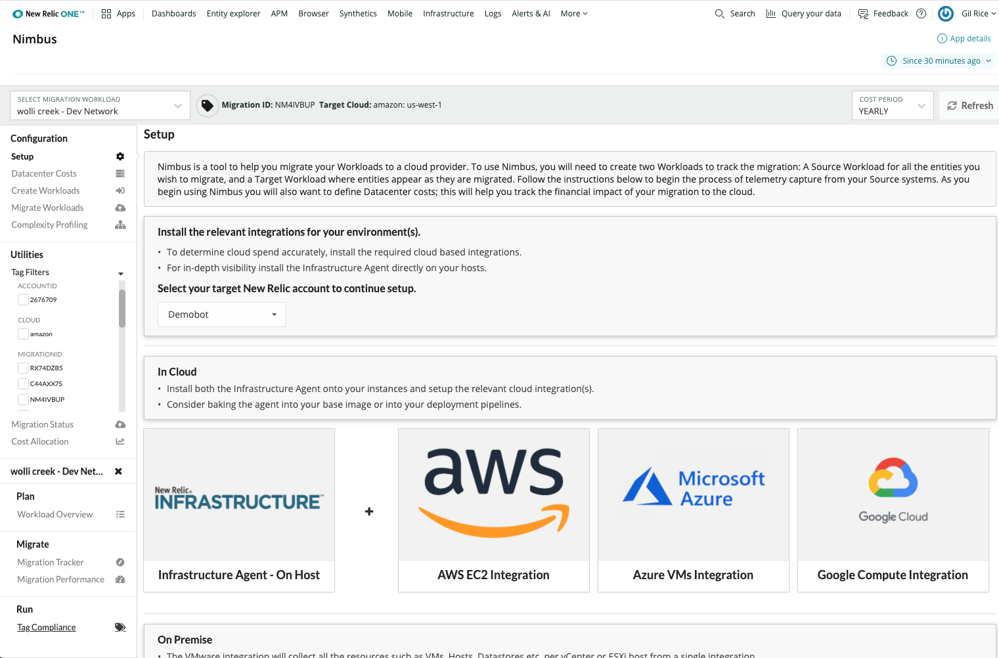

### 3. Datacenter Costs >> Create cost models for the entities within your Datacenter
- The Datacenter Costs page allows you to add new or modify the costs associated with a Datacenter. 
  
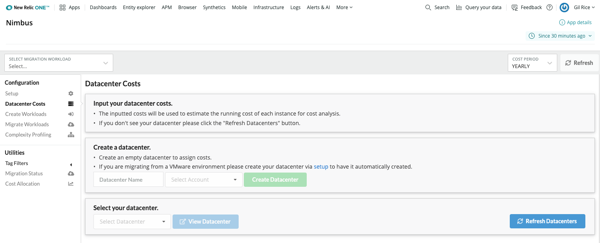

- Create a new Datacenter by entering a Name and selecting the appropriate account wherein the Datacenter Entities reside. 

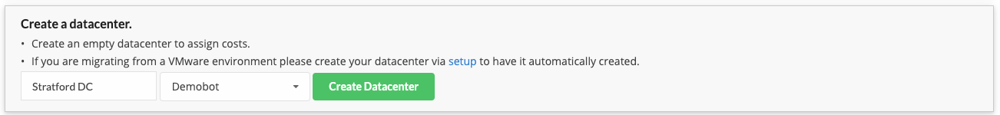

- Once you have created your Datacenter you can being by adding costs. 

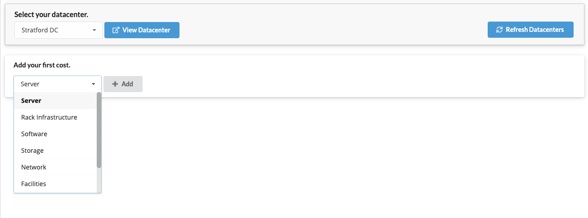

- For example, indicate the cost recurrence, units, and rate. Also add some details about this cost, give it a name and short description. 
  
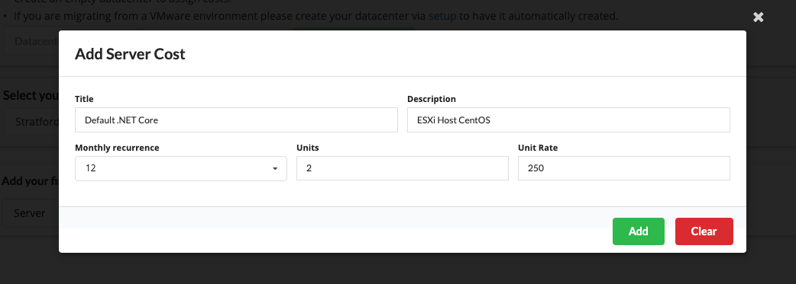

- As you enter costs you will see you Datacenter cost model build up. The Nimbus App uses these costs to provide a view into the legacy and future cost comparison of your migration.

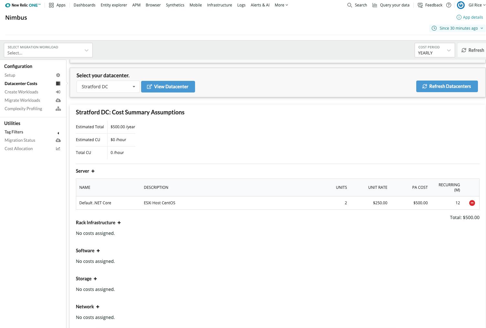

### 4. Create Workloads >> Workloads are the Entity groups for your Cloud Migration
-  The "Create Workloads" provides helps you to group Entities within your New Relic account. These Entity groups become the basis for the Migration. As entities from a Source Workload make their way into a Target Workload, they transition from one Datacenter to another. We can then use Nimbus to report on the costs and performance implications of this transition.  

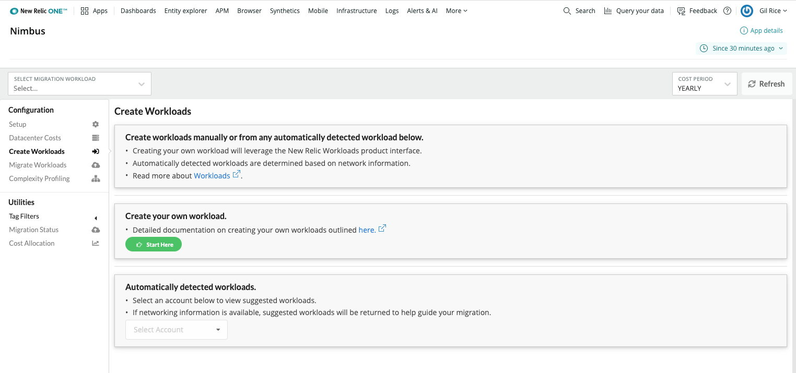

- When you click on the "Start Here" Nimbus opens up the New Relic Workloads create page. This is the same experience you would expect creating workloads in your New Relic account. 

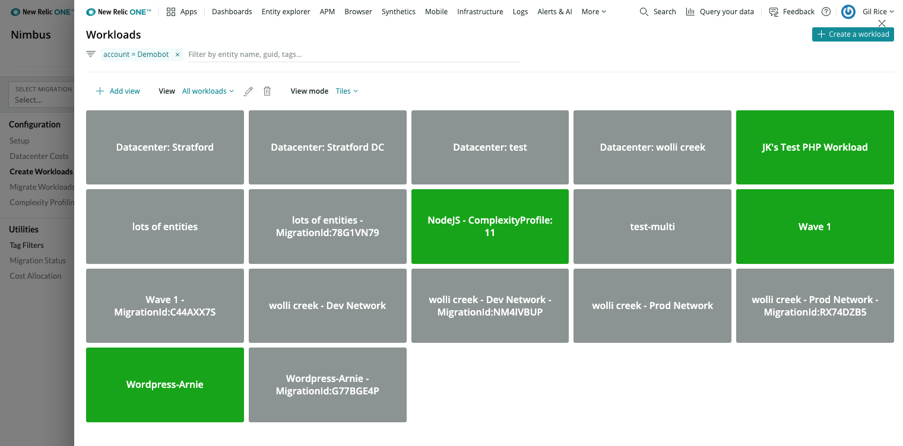

- To create a Workload that defines the Entities for your migration, you can use search to identify groups of Entities for inclusion. Follow these [documents](https://docs.newrelic.com/docs/new-relic-one/use-new-relic-one/workloads/use-workloads) for information on setting up workloads.  

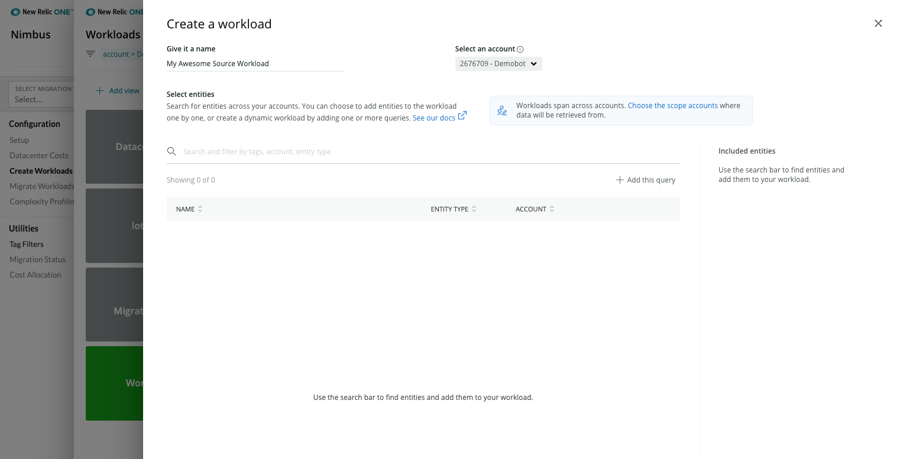

- The "Create Workloads" page also provides a handy utility to group Entities that are reporting via vSphere integration. Grouping Entities by subnet into a single workload is often a convenient way to manage Entities through the migration process.  

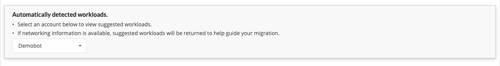

### 5. Migrate Workloads >> Select a Source Workload to being migration tracking

- The "Migrate Workloads" page allows you to begin a Workload migration project, access the Workloads in play, or see the current Entity counts for the migration.

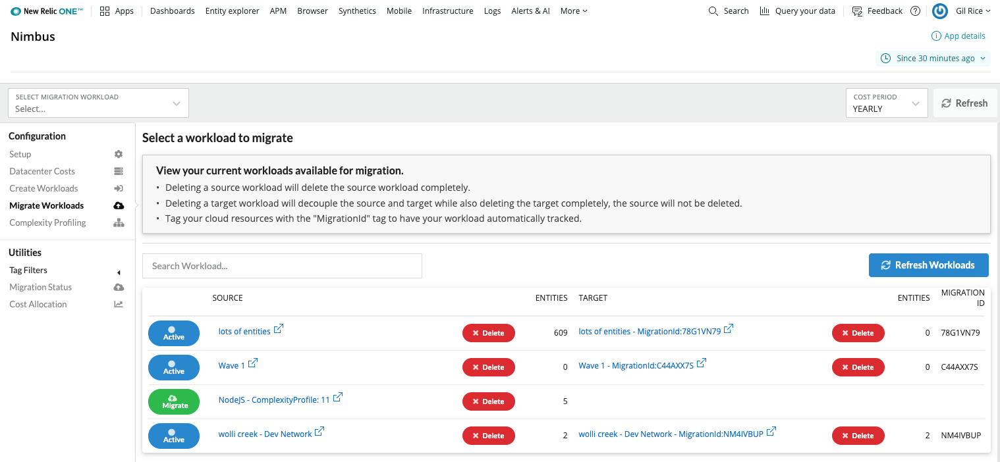

-  When you click on a prospective Workload to "Migrate", a dialog will open asking you to define some details. Select the Account you wish to associate to this Migration, the Target Cloud provider, and the Cloud Provider's Region. Also give the project a name and select the source Datacenter you set up for your migration (this will provide Entity cost details). If you have already defined a Target Workload manually select it from the available drop-down, if not an empty workload will be generated for you for this migration. 
  

### 6. Complexity Profiling >> Understand more about your Service Entities for Migration

- The Complexity Profiling tool gives you a quick and easy way to evaluate the Service Entities reporting into your New Relic accounts, and to quickly create Workload for each. 
  
- When you select an Account, Nimbus will evaluate all the Service Entity types reporting into that Account. It will categorize them by application runtime type (e.g. .NET Core, Java) or framework / packaged application (e.g. Wordpress, Django). Nimbus will look at the number of different Entities reporting, and seek to evaluate the underlying complexity of the service's implementation by evaluating how many different [Transactions](https://docs.newrelic.com/docs/apm/transactions/intro-transactions/transactions-new-relic-apm) are exposed by the Service.     
  
- You can quickly create a new Workload from the Complexity Analysis by clicking the aptly titled "Create workload" button. This will create a Workload object in the target account for use as a migration source.

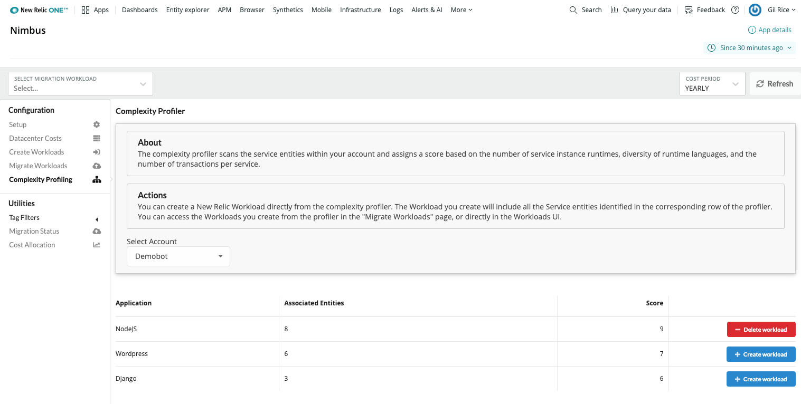

## Utilities

- The Utilities section of the Nimbus UI provides tools to review the progress of Entity/Workload migration against the (Plan, Migrate. Run) phases of your migration project.  

### 7. Tag Filters >> Allows you to scope the migration Workloads in Nimbus

- The "Tag Filters" section that appears under the "Utilities" left hand navigation in the Nimbus UI allows you to select one or more tags in order to reduce the total number of Migration Workloads visible for your inspection. This comes in handy when you have tens or hundreds of Workloads you're in the process of migrating. 
 
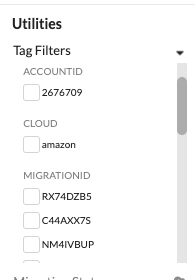

### 8. Migration Status >> A rollup of current migration Workload states

- The Migration Status page reports the point in time migration progress for each Workload and aggregates the status of Workloads in Source, Target and Summary views. 

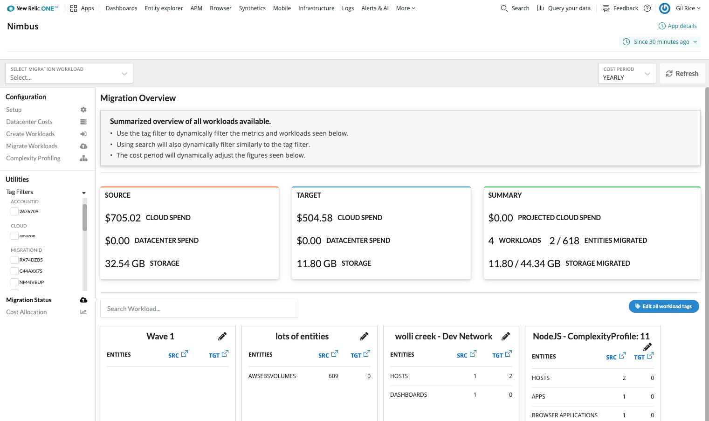

### 9. Cost Allocation >> Demonstrates the cost perspective between Source and Target Workloads

- Once you have created an initial snapshot defined the Cost Allocation report will demonstrate how your Source and Target Datacenter spends change during the migration.  

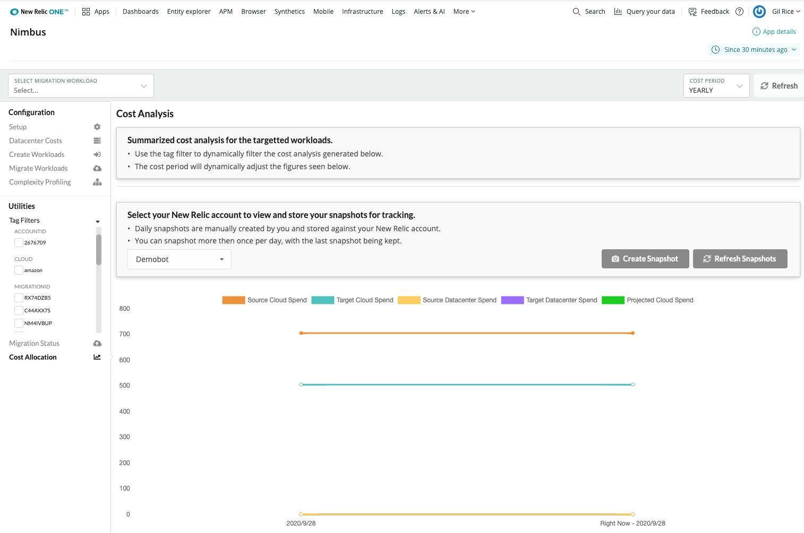
